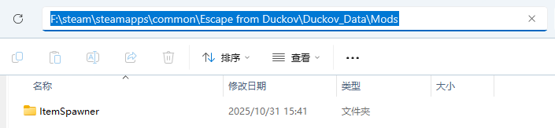
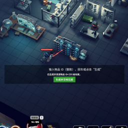

# 逃离鸭科夫自制mod---物品生成器

#### 使用方法

将ItemSpawner文件夹整体复制到游戏安装目录（例如：F:\steam\steamapps\common\Escape from Duckov\Duckov_Data）下的Mods（没有这个文件夹可以先自己创建）文件夹下

打开游戏在mod选项中勾选即可启用

按下F10开启/关闭输入面板，输入整数物品id回车即可将对应物品放入背包

（每个物品对应的id可以自行网上搜索得到，也可以自己一个一个试哈哈哈😁）

#### 代码

mod代码在TestMod文件夹下，Mod框架可以参考官方给出的[仓库]([xvrsl/duckov\_modding](https://github.com/xvrsl/duckov_modding))
